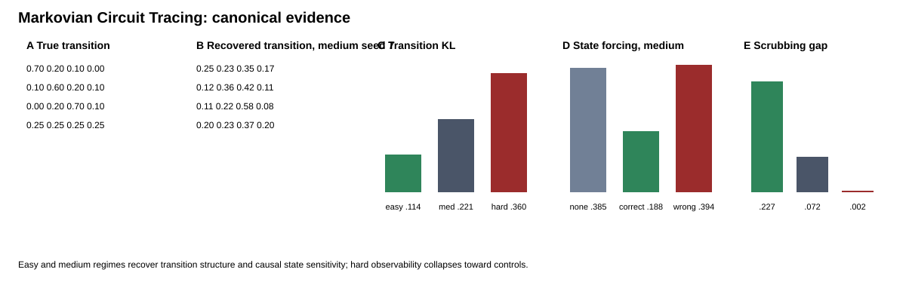

# Markovian Circuit Tracing

**Markovian Circuit Tracing (MCT)** is a controlled mechanistic-interpretability benchmark for testing when transformer activations admit a compact state abstraction with recoverable transition structure and causal predictive relevance.

The benchmark trains small causal transformers on sequences generated by Hidden Markov Models (HMMs) whose latent states, transition law, emission law, exact Bayesian predictive beliefs, and counterfactual token distributions are known. This lets the repository evaluate internal state abstractions against exact ground truth rather than relying only on prompt-local interpretability judgments.

## Main finding

The canonical artifact contains **15 confirmatory runs** across three HMM observability regimes and five fixed seeds `[7, 17, 29, 43, 71]`.

All models were trained until model-validation cross-entropy was within `0.02` nats/token of the exact Bayes oracle, subject to a 30-epoch cap. All 15 runs met that stopping criterion.

The central result is **observability dependence**:

| Regime | Transition KL ↓ | Shuffled control KL ↓ | Causal scrubbing gap ↑ | Interpretation |
|---|---:|---:|---:|---|
| Easy | 0.114 | 0.379 | 0.227 | Strong recoverable and causal state structure |
| Medium | 0.221 | 0.355 | 0.072 | Weaker but still clear state structure |
| Hard | 0.360 | 0.367 | 0.002 | Transition recovery collapses toward controls |

Across seeds, recovered transition structure beats shuffled controls in the easy and medium regimes, but not in the hard regime. Same-state activation swaps perturb model outputs substantially less than different-state swaps in all three regimes, although the effect becomes very small under hard observability.

State forcing also behaves selectively in easy and medium regimes: forcing the recovered target-state centroid moves outputs closer to the exact HMM state-conditioned target than leaving the model unpatched or forcing the wrong centroid. In the hard regime, forcing improves over no patch but is not distinguishable from forcing the wrong recovered centroid, so state-specific causal forcing is **not supported** there.

## Important negative results

The repository deliberately preserves results that weaken the strongest version of the hypothesis.

* Bayesian predictive beliefs are linearly decodable from trained activations, with mean held-out R² of `0.925`, `0.849`, and `0.777` for easy, medium, and hard HMMs respectively. However, the trained representation does **not** reliably outperform an untrained transformer representation, and a four-token explicit history baseline is better in the medium and hard regimes. Belief decodability therefore is not, by itself, evidence for a uniquely learned internal belief code.
* A fixed sparse autoencoder (SAE) does **not** improve transition recovery. It is approximately neutral in the easy regime and worse in medium and hard regimes.
* First-order Markov gains are strongest in the easy regime, weaker in medium, and absent in hard.
* No natural-language or frontier-model extrapolation is included in the canonical evidence. The claims are restricted to the controlled HMM benchmark.

These negative results are part of the contribution: MCT is intended to test when a state-machine abstraction is justified, including cases where it fails.

## Main figure



Additional figures:

* [`figure_2_belief_recovery.svg`](results/v1/figures/figure_2_belief_recovery.svg)
* [`figure_3_sae_comparison.svg`](results/v1/figures/figure_3_sae_comparison.svg)

## What exactly is being tested?

At transformer position `t`, the causal language model has observed `x_<t` and predicts `x_t`. The exact latent quantity available from those observations is therefore the **predictive hidden-state belief**

`P(s_t | x_<t)`.

MCT asks four separate questions:

1. **Predictive competence**: does the transformer solve the HMM prediction task near the exact Bayes optimum?
2. **Representational recoverability**: can predictive beliefs and sampled hidden states be decoded from held-out activations beyond explicit history and untrained-model controls?
3. **Dynamical recoverability**: does a discrete abstraction learned only on calibration sequences yield a held-out transition matrix closer to the true HMM law than random or shuffled controls?
4. **Causal relevance**: do state forcing and same-state/different-state activation swaps change predictions in the direction expected from the recovered state abstraction?

See [`docs/STATE_SEMANTICS.md`](docs/STATE_SEMANTICS.md) for the temporal convention.

## Canonical protocol

The frozen protocol is in [`configs/main_experiment.yaml`](configs/main_experiment.yaml).

It uses:

* 3 observability regimes: easy, medium, hard
* 5 fixed seeds: 7, 17, 29, 43, 71
* 60% calibration, 20% selection, 20% untouched evaluation sequences
* 2-layer, 64-dimensional causal transformer
* Bayes-gap validation stopping rule
* token-history baselines of length 1, 2, and 4
* same-architecture untrained-transformer control
* held-out cluster discovery/alignment protocol
* state-forcing controls
* causal scrubbing
* fixed SAE comparison

No evaluation-set label is used to fit cluster geometry, cluster-to-state alignment, probe parameters, intervention centroids, or SAE hyperparameters.

## Reproduce the canonical artifact

```bash
python -m venv .venv
source .venv/bin/activate
pip install -e .
python scripts/run_benchmark_suite.py
python scripts/aggregate_results.py
python scripts/analyze_claims.py
python scripts/make_figures.py
python scripts/verify_artifact.py
```

On Windows PowerShell, activate with `.venv\Scripts\Activate.ps1`.

The verifier requires all 15 canonical cells and regenerates `results/v1/MANIFEST.json` with SHA-256 hashes.

## Evidence bundle

The committed evidence lives under [`results/v1/`](results/v1/):

* `raw_runs.json` is a compact 15-cell run index with extracted per-run metrics. Full per-control intervention rows are in `tables/forcing_controls.csv`; complete generated run directories are reproducible from the frozen configuration.
* `summary.json` contains aggregate statistics.
* `claims.json` records the claim-status analysis and paired cross-seed tests.
* `tables/` contains per-run and aggregate CSVs.
* `figures/` contains the canonical figures.
* `MANIFEST.json` contains file checksums.

The full generated per-cell directories are reproducible with `scripts/run_benchmark_suite.py` and are not required for understanding the committed result bundle.

## Repository layout

```text
configs/                 frozen benchmark configuration
src/mct/                 HMMs, transformer, probes, state abstraction, interventions, SAE
experiments/             single-run experimental pipeline
scripts/                 canonical suite, aggregation, figures, claims, verification
results/v1/              committed canonical evidence
docs/                    semantics, methods, baselines, results, claims, limitations
paper/                    paper-facing outline derived from the completed evidence
tests/                    scientific and pipeline tests
.github/workflows/        CI and canonical benchmark workflow
```

## Claim boundary

MCT **does not claim that transformers are globally first-order Markov systems**. It tests whether a chosen internal abstraction behaves approximately like a reusable probabilistic state machine in a setting where the true latent dynamics and exact counterfactual targets are known.

The completed benchmark supports that abstraction under easy and medium observability, and shows where it degrades under hard partial observability.

## Documentation

* [Methods](docs/METHODS.md)
* [Results](docs/RESULTS.md)
* [Claims](docs/CLAIMS.md)
* [Baselines](docs/BASELINES.md)
* [Reproducibility](docs/REPRODUCIBILITY.md)
* [Limitations](docs/LIMITATIONS.md)

## Citation

See [`CITATION.cff`](CITATION.cff).

## License

MIT.
